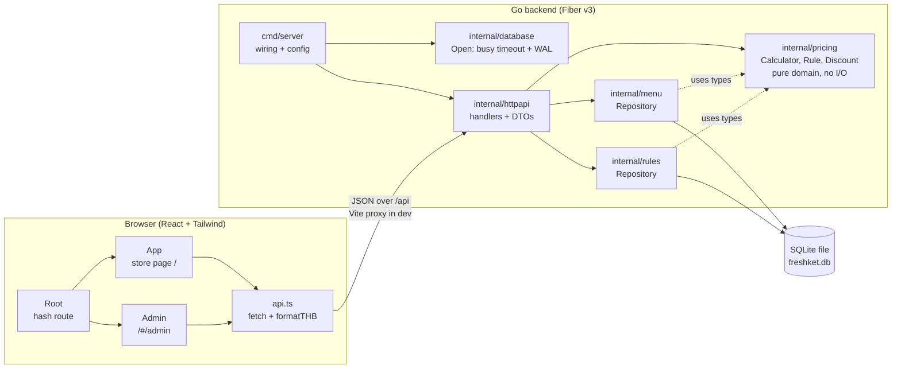
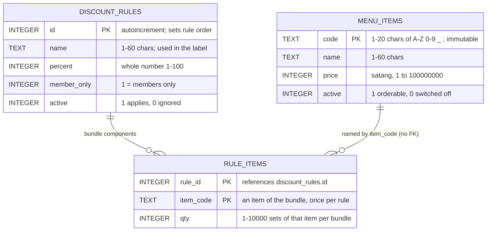
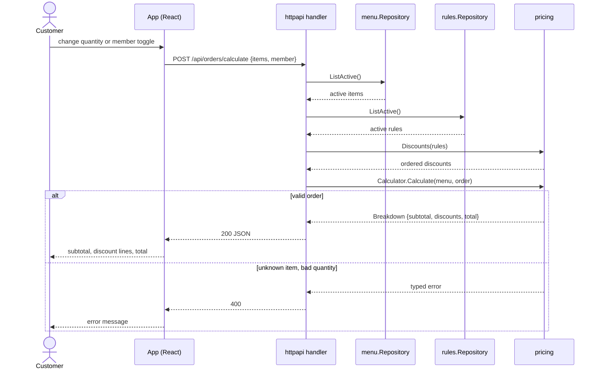
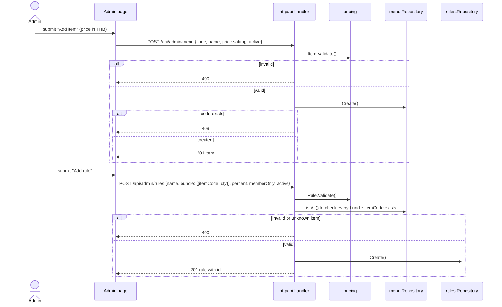
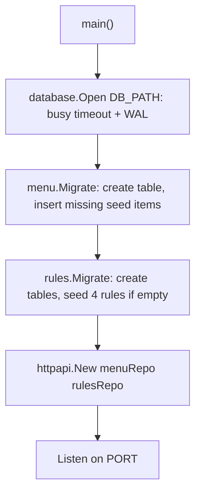
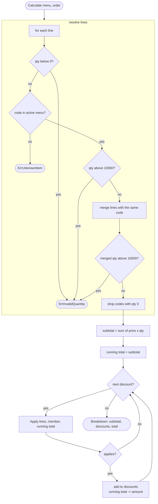
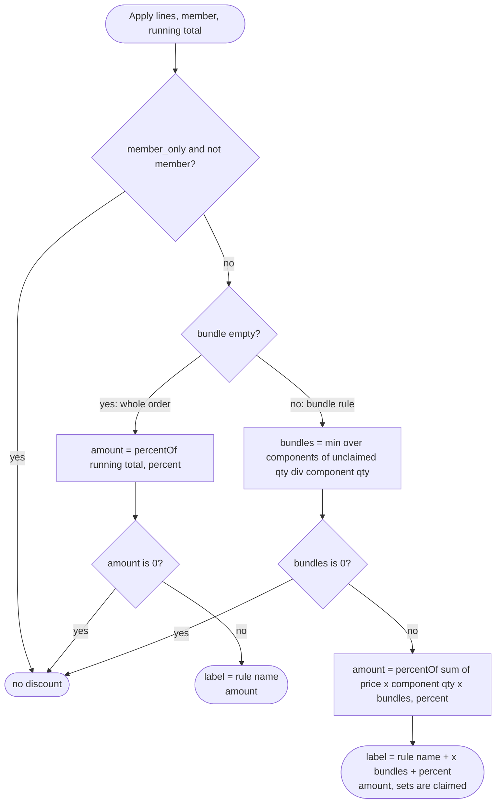
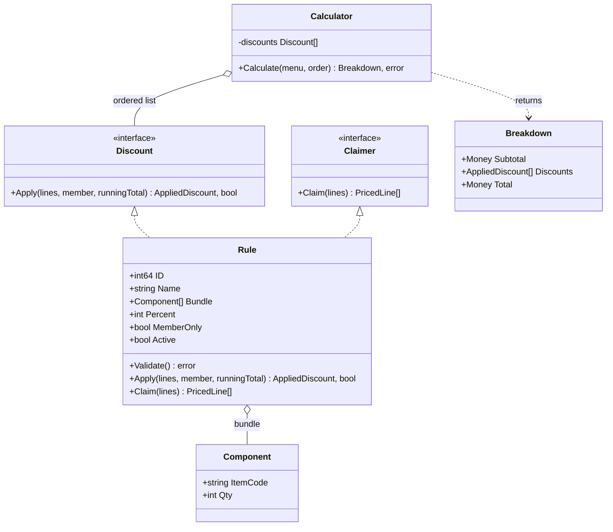

# Architecture and Design

Diagrams are [Mermaid](https://mermaid.js.org/) and render on GitHub. All amounts are integer **satang** (1 THB = 100 satang).

1. [System architecture](#1-system-architecture)
2. [ER diagram](#2-er-diagram)
3. [Request flows](#3-request-flows)
4. [Calculation logic](#4-calculation-logic)
5. [Rule model](#5-rule-model)
6. [Errors and status codes](#6-errors-and-status-codes)

## 1. System architecture

The backend owns every pricing rule. The frontend only displays what the API returns. Dependencies point inward: `pricing` imports nothing from Fiber, SQLite or `net/http`.



| Package | Responsibility |
|---|---|
| `cmd/server` | Reads `PORT` and `DB_PATH`, opens SQLite through `database.Open`, runs both migrations, starts Fiber |
| `internal/database` | Opens the SQLite file with a 5 second busy timeout and WAL, so concurrent admin writes and customer calculations do not fail with `SQLITE_BUSY` |
| `internal/httpapi` | Routes, JSON DTOs, validation-to-status mapping. Loads items and rules per request. `httpapi.go` has the public routes, `admin_menu.go` and `admin_rules.go` the admin ones |
| `internal/pricing` | `Calculator`, the `Discount` and `Claimer` interfaces, the data-driven `Rule` (bundle conditions), validation, rounding |
| `internal/menu` | Menu items in SQLite: list active or all, create, update, seed |
| `internal/rules` | Discount rules and their bundle components in SQLite: list active or all, create, update (in a transaction), seed |
| `frontend/src` | `Root` (hash route + Admin/Store button), `App` (store), `Admin`, `api.ts` |

## 2. ER diagram

Three tables. A rule's bundle lives in `rule_items`, one row per component; `rule_items.item_code` refers to `menu_items.code` by value, with no foreign key. A rule without `rule_items` rows applies to the whole order. Rows are never deleted, only switched off with `active = 0` (a rule's components are replaced when the rule is edited).



Seed data. Rules are inserted only when `discount_rules` is empty; menu items use `INSERT OR IGNORE`, so a seed code that is missing is added back at startup and existing rows (including edited prices) are left alone:

| Table | Rows |
|---|---|
| `menu_items` | RED 50, GREEN 40, BLUE 30, YELLOW 50, PINK 80, PURPLE 90, ORANGE 120 THB |
| `discount_rules` + `rule_items` | `Orange pairs`, `Pink pairs`, `Green pairs`: 5%, a bundle of 2 × that item; `Member 10%`: 10% whole order (no bundle), members only |

## 3. Request flows

### 3.1 Calculate an order

Every calculation reads the **current** items and rules, so admin changes apply immediately with no restart.



### 3.2 Admin adds an item or a rule



After either call the next customer calculation uses the new data.

### 3.3 Startup



## 4. Calculation logic

### 4.1 Pipeline

`Calculator.Calculate(menu, order)` runs these steps in order:



### 4.2 Discount order

`pricing.Discounts(rules)` builds the list the calculator walks:

1. Drop inactive rules.
2. **Bundle rules** (with `rule_items`) come first, then **whole-order rules**.
3. Bundle rules: bigger bundle first (sum of component quantities), ties by ascending rule `id`. Whole-order rules: ascending `id`.

Bundle rules go first so the whole-order percent applies to the already-reduced total. Bigger bundles go first because a bundle **claims** its sets: after a bundle rule applies, `Calculator` calls `Claim` on it and later rules only see the unclaimed sets, so one set is never discounted twice. Going biggest first lets "Green ×2 + Red ×1" win the Greens over a plain Green pair rule.

### 4.3 One rule: `Rule.Apply`



### 4.4 Rounding

```
percentOf(amount, percent) = (amount * percent + 50) / 100     // integer division, half-up
```

Applied at every discount step, so a result is always a whole number of satang and the same input always gives the same output.

### 4.5 Worked examples

Menu: Orange 12000 satang. With the seed rules:

**Orange × 5, member**

| Step | Computation | Running total |
|---|---|---|
| Subtotal | 5 × 12000 | 60000 |
| `Orange pairs` (bundle of 2 × ORANGE) | bundles = 5 div 2 = 2, covered sets = 4, 5% of 48000 | 60000 − 2400 = **57600** |
| `Member 10%` (whole order) | 10% of 57600 | 57600 − 5760 = **51840** |

Result: ฿518.40, discount lines `Orange pairs ×2 (5%)` −24.00 and `Member 10%` −57.60.

**Green × 2, Pink × 3, non-member**

| Step | Computation | Running total |
|---|---|---|
| Subtotal | 2 × 4000 + 3 × 8000 | 32000 |
| `Pink pairs` (rule id 2) | bundles = 1, 5% of 16000 | 32000 − 800 |
| `Green pairs` (rule id 3) | bundles = 1, 5% of 8000 | 31200 − 400 = **30800** |
| Member rule | not a member | skipped |

Result: ฿308.00. Discount lines follow rule ID, so PINK (800) is listed before GREEN (400).

**Rounding case**: an item priced at 1005 satang, one set, member → 10% of 1005 = 100.5, rounded half-up to 101, total 904.

**A bundle added from the admin page**: Bundle A = 2 × GREEN + 1 × RED, 12% (rule id 5). Menu: Green 4000, Red 5000.

Green × 4, Red × 1, non-member:

| Step | Computation | Running total |
|---|---|---|
| Subtotal | 4 × 4000 + 1 × 5000 | 21000 |
| `Bundle A` (3 sets, goes before the 2-set pair rule) | bundles = min(4 div 2, 1 div 1) = 1, 12% of 8000 + 5000 | 21000 − 1560 = 19440; claims Green × 2 and Red × 1 |
| `Green pairs` (rule id 3) | 2 unclaimed Green, bundles = 1, 5% of 8000 | 19440 − 400 = **19040** |

Result: ฿190.40, discount lines `Bundle A ×1 (12%)` −15.60 and `Green pairs ×1 (5%)` −4.00. Green × 2 + Red × 1 alone gives only the Bundle A line: ฿114.40.

## 5. Rule model

A rule is one `discount_rules` row plus its `rule_items` rows. Its condition is only a bundle of item × quantity components (plus an optional members-only flag). Its effect is only a whole-number percent. A bundle of one item with quantity N is the plain "every N sets of one item" rule.

| Field | Bundle rule | Whole-order rule |
|---|---|---|
| `rule_items` | one or more components, each an existing item code once, qty 1 to 10000 | none |
| `percent` | 1 to 100, taken off the sets in every complete bundle | 1 to 100, taken off the running total |
| `member_only` | optional | optional (the seed member rule sets it) |
| Label | `<Rule name> ×<bundles> (<percent>%)` | the rule name, verbatim |

`pricing.Rule` implements the `Discount` interface (and `Claimer`, to use up the sets it discounts), so `Calculator` does not know rules exist. A new kind of condition, for example a minimum total, would be a new type implementing `Discount` and nothing else changes.



## 6. Errors and status codes

| Situation | Source | HTTP |
|---|---|---|
| Unknown or inactive item code in an order | `ErrUnknownItem` | 400 |
| Negative quantity, or more than 10000 of one item | `ErrInvalidQuantity` | 400 |
| Malformed JSON, or a field of the wrong type | body bind | 400 |
| Invalid item (bad code, empty name, price below 1) | `ErrInvalidItem` | 400 |
| Invalid rule (percent outside 1-100, bundle quantity out of range or item listed twice, empty name) | `ErrInvalidRule` | 400 |
| Bundle refers to an item code that does not exist | `checkRule` | 400 |
| Duplicate item code on create | `menu.ErrDuplicate` | 409 |
| Update of a missing item or rule | `menu.ErrNotFound`, `rules.ErrNotFound` | 404 |
| Non-numeric rule id in the path | path parse | 400 |
| Anything unexpected (database failure) | any other error | 500 |

Admin routes (`/api/admin/*`) have no authentication, by design: this is a simulation.
